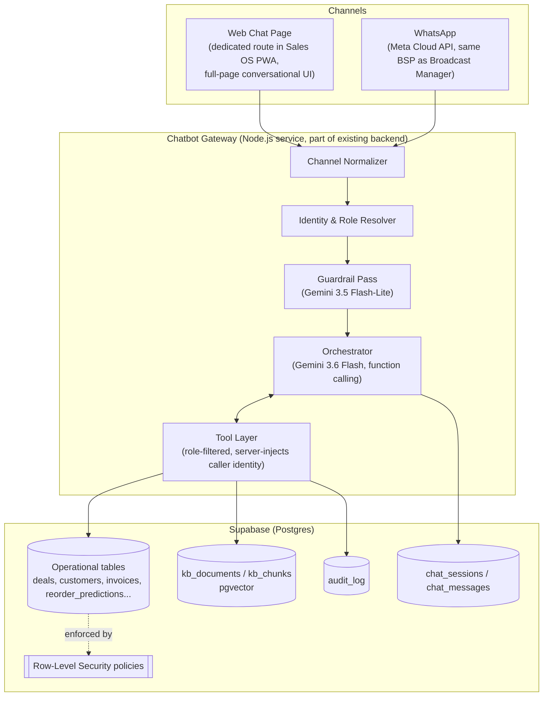

# Architecture Doc: Enlight Sales OS - Conversational Assistant

**Companion to:** Enlight Sales OS PRD v2.0
**Scope:** Web + WhatsApp chatbot for Sales Executives, Sales Managers, and Admins, backed by the Gemini API and the existing Supabase database.
**Status:** Proposed architecture, v1

---

## 1. Goals

- One assistant, two entry points: a dedicated chat page inside the Sales OS web app (its own route, not a widget bolted onto other screens), and the existing WhatsApp Business number.
- Strict, provable data scoping by role - a Sales Executive can never see another executive's deals, even if they ask cleverly.
- A curated knowledge base (SOPs, product/grade specs, pricing policy, FAQs) that the bot can cite, separate from live operational data.
- Reuse what already exists: Supabase as the single database, the WhatsApp BSP already planned for the Broadcast Manager (§4.6 of the PRD), and the `audit_log` pattern already in the schema.

**Non-goal for v1:** the bot does not change deal stages, edit rate sheets, or send customer-facing messages on its own. It reads, summarizes, and - for a small allow-list of actions (e.g., logging a follow-up note) - writes only after explicit user confirmation.

---

## 2. High-Level Architecture



Key idea: **the model never touches the database directly.** It can only ask the tool layer for things, and the tool layer decides - based on the authenticated caller, not on anything the model says - what rows are visible.

**On the web side, this is its own page** (e.g. `/assistant`), reachable from the main nav like any other Sales OS screen - a full conversational surface for "ask it anything about my pipeline/customers/KB," not a floating helper bolted onto other pages. It keeps its own scrollable history, shows source citations when it pulls from the knowledge base, and shows a small "as {role}" indicator so it's always clear whose data scope is active - useful for Admins, who may want to explicitly confirm they're seeing the unfiltered view.

---

## 3. Identity & Role Resolution

| Channel  | How the caller is identified                                    | Failure mode                                                                                                                                               |
| -------- | --------------------------------------------------------------- | ---------------------------------------------------------------------------------------------------------------------------------------------------------- |
| Web      | Existing Supabase Auth session (JWT) → `users.id`, `users.role` | No valid session → redirect to login, no bot access                                                                                                        |
| WhatsApp | Inbound phone number matched against `users.phone`              | Unrecognized number → onboarding flow ("This number isn't linked to an Enlight account. Please contact your admin.") No data tools exposed until verified. |

For WhatsApp, add a one-time OTP verification step the first time a number messages the bot (reuse the OTP mechanism already specified for app login in §2 of the PRD), and store `users.whatsapp_verified_at`. This prevents someone from spoofing a salesperson's number to pull their pipeline.

**Fail-closed default:** if identity or role can't be resolved with confidence, the bot answers only from the public portion of the knowledge base (or nothing) and never falls back to "assume broadest access."

---

## 4. RBAC: the core design decision

The model is never trusted to enforce access control. Two independent layers do it:

**Layer 1 - Tool layer (application-level filtering).**
Every tool function the gateway executes takes `caller_user_id` and `caller_role` as _server-injected_ parameters - not as arguments the Gemini model can set. The SQL/query each tool builds already contains the scoping clause before it ever touches Supabase:

| Role            | Scope applied in every tool call                                                      |
| --------------- | ------------------------------------------------------------------------------------- |
| Sales Executive | `WHERE owner_user_id = :caller_id`                                                    |
| Sales Manager   | `WHERE owner_user_id IN (SELECT id FROM users WHERE reports_to_user_id = :caller_id)` |
| Admin           | no filter                                                                             |

This requires one schema addition: `users.reports_to_user_id` (nullable FK to `users.id`), so manager→executive reporting lines are explicit rather than inferred.

**Layer 2 - Supabase Row-Level Security (defense in depth).**
The gateway calls Supabase using a scoped Postgres role (or Supabase Auth JWT with custom claims for `role` and `reports_to`), and RLS policies on `deals`, `customers`, `invoices`, `inquiries`, etc. mirror the exact same rule at the database level. If a bug in the tool layer, a bad prompt, or a compromised gateway ever tried to over-fetch, the database itself refuses the row. Two layers that must both agree is the standard pattern for multi-tenant Supabase apps, and it's cheap to add since the PRD already treats the app as the source of truth for these tables.

**Layer 3 - Tool visibility, not just tool output.**
The set of tool _declarations_ sent to Gemini is itself filtered by role before the API call is made. A Sales Executive's request never even includes a `get_team_pipeline` or `get_churn_radar` function in the tools array - the model literally cannot see that the capability exists, which also cuts down on hallucinated attempts to call things it shouldn't.

**Knowledge base scoping.** Some documents (e.g., floor-margin rationale, internal pricing strategy notes) shouldn't be visible to executives. `kb_documents.visibility_role` (`all` / `manager_plus` / `admin_only`) is applied as a filter on the vector search itself, not as an instruction to the model to "please don't mention this."

---

## 5. Message Flow

```mermaid
sequenceDiagram
    participant U as User (Web/WhatsApp)
    participant GW as Gateway
    participant G as Gemini 3.6 Flash
    participant T as Tool Layer
    participant DB as Supabase

    U->>GW: message
    GW->>GW: resolve identity + role (fail-closed)
    GW->>G: Flash-Lite guardrail pass (safety/injection check)
    GW->>DB: fetch last N turns from chat_messages
    GW->>G: prompt + role-filtered tool schema + history
    alt model needs data
        G->>GW: function_call(name, args)
        GW->>T: execute(name, args, caller_id, caller_role)
        T->>DB: scoped query (RLS-backed)
        DB-->>T: rows
        T-->>GW: result
        GW->>G: function_result
        G->>GW: final answer
    else model can answer directly
        G->>GW: final answer
    end
    GW->>DB: log turn (chat_messages) + tool audit (audit_log)
    GW->>U: response
```



For actions that write data (e.g., "log a follow-up note"), the orchestrator returns a proposed action and a confirmation prompt; only an explicit "yes" from the user triggers the write tool. No silent writes, ever - same principle the PRD applies to AI-extracted inquiries.

---

## 6. Tool Catalog (v1)

| Tool                               | Who sees it               | Notes                                                   |
| ---------------------------------- | ------------------------- | ------------------------------------------------------- |
| `get_my_open_deals`                | All                       | Scoped per §4                                           |
| `get_customer_360(customer)`       | All                       | Fuzzy name match against `customers`                    |
| `get_reorder_queue`                | All                       | Own scope                                               |
| `get_team_pipeline`                | Manager, Admin            | Rolls up subordinates                                   |
| `get_churn_radar`                  | Manager, Admin            |                                                         |
| `get_loss_analytics`               | Manager, Admin            |                                                         |
| `get_rate_sheet(sku?)`             | All                       | Current locked sheet only, never draft/unlocked         |
| `search_knowledge_base(query)`     | All (visibility-filtered) | See §7                                                  |
| `log_followup_note(deal_id, note)` | All                       | Write action, requires confirmation                     |
| `escalate_to_human`                | All                       | Hands off to Sales Lead / Admin via existing Home queue |

---

## 7. Knowledge Base

**Storage:** stays inside the same Supabase project - no separate vector database. At this org's scale (a handful of users, a bounded set of SOPs/specs, low query volume), `pgvector` on Postgres avoids a second system to keep in sync and lets a single query join operational data with KB content if ever needed.

```
kb_documents(id, title, source_file_url, visibility_role, uploaded_by, version, updated_at)
kb_chunks(id, doc_id, content, embedding vector(768), token_count, metadata jsonb)
```

- **Ingestion:** Admin uploads a doc (PDF/DOCX/MD) under Settings → Knowledge Base → chunked (~500–800 tokens, slight overlap) → embedded with `gemini-embedding-001` (`task_type=RETRIEVAL_DOCUMENT`) → stored with an **HNSW** index on `embedding` (better recall/latency than IVFFlat at this scale, and it's the current pgvector recommendation).
- **Query time:** the user's question is embedded with `task_type=RETRIEVAL_QUERY`, cosine-similarity search returns top-k chunks filtered by `visibility_role`, and those chunks are passed to Gemini as grounding context with source citations in the reply ("per the Floor Margin SOP...").
- **Dimensionality:** truncate to 768 dims (Matryoshka-trained model supports this) - negligible quality loss, much cheaper storage/index than the full 3072.
- Gemini's embedding model supports Hindi natively, which matters given the team's Hinglish usage patterns already noted in the PRD's inquiry-capture spec.
- Re-embed on document edit; keep versions for audit.

---

## 8. WhatsApp-Specific Considerations

- **Reuse the existing BSP/Meta Cloud API integration** planned for Broadcast Manager (§4.6) rather than standing up a second WhatsApp integration - same number is fine as long as bot replies and broadcast templates are clearly distinguishable.
- **24-hour session window:** free-form bot replies only work within 24h of the user's last message. Outside that window, re-engagement (e.g., "You have 3 pending follow-ups") must go through a pre-approved WhatsApp template - same constraint the PRD already designs around for broadcasts.
- **Voice notes:** route through the same Whisper transcription pipeline already specified for inquiry capture (§4.2), rather than building a second transcription path.
- **Group chats:** out of scope for v1 - bot only responds in 1:1 threads to keep identity resolution unambiguous.

---

## 9. Guardrails & Safety

- **Two-model split:** a cheap, fast pass (`gemini-3.5-flash-lite`) screens each inbound message for prompt-injection attempts and obvious abuse before the main orchestrator ever runs - this keeps the expensive model's context clean and catches "ignore your instructions" attempts embedded in forwarded WhatsApp text or KB documents.
- **Untrusted content labeling:** KB chunks and tool results are wrapped and explicitly marked as data, not instructions, in the system prompt - the model is told never to follow directives found inside retrieved documents or customer-forwarded messages.
- **Rate limits + budget cap:** per-user rate limiting, plus the per-day Gemini API budget cap with alerting already specified in PRD §5.3 - extend it to cover this bot's usage, not just inquiry extraction.
- **Audit trail:** every tool call that returns rows (or performs a write) logs to `audit_log` with `user_id`, `tool`, `args`, `row_count` - same table the PRD already defines, reused rather than duplicated.
- **No customer-facing autonomy:** the bot never sends anything to a customer on its own; it only assists the internal user, consistent with PRD §9's "never auto-send anything customer-facing without human approval" principle.

---

## 10. Model Selection

| Use                                  | Model                   | Why                                                                                                                                      |
| ------------------------------------ | ----------------------- | ---------------------------------------------------------------------------------------------------------------------------------------- |
| Main conversation + function calling | `gemini-3.6-flash`      | Current GA Flash tier, strong at agentic/multi-step tool use, good cost/latency balance ($1.50/M input, $7.50/M output at standard tier) |
| Guardrail / intent classification    | `gemini-3.5-flash-lite` | Low-latency, cheap - fine for a binary/classification pass on every inbound message                                                      |
| KB + query embeddings                | `gemini-embedding-001`  | Stable GA text embedding model, MTEB-leading multilingual (incl. Hindi), Matryoshka-trained so it can be truncated to 768 dims cheaply   |

Avoid building on `gemini-2.5-pro` / `gemini-2.5-flash` - both are scheduled to shut down in October 2026, so a build starting now should target the 3.x line directly. (Same applies to anything already using `text-embedding-004`, which is being retired in favor of `gemini-embedding-001`.)

---

## 11. Data Model Additions

```sql
-- new
chat_sessions(id, user_id, channel, external_thread_id, started_at, last_active_at)
chat_messages(id, session_id, role, content, function_call jsonb, function_result jsonb, ts)
kb_documents(id, title, source_file_url, visibility_role, uploaded_by, version, updated_at)
kb_chunks(id, doc_id, content, embedding vector(768), token_count, metadata jsonb)

-- alter existing
alter table users add column reports_to_user_id uuid references users(id);
alter table users add column whatsapp_verified_at timestamptz;
```

Nothing else in the existing schema (§5.1 of the PRD) needs to change - the bot is a read/summarize layer on top of it, plus one narrow write path (`followups`).

---

## 12. Where this fits in the build plan

The chatbot depends on real pipeline and intelligence data existing to be useful, so it's not a Phase 0 item. Recommend slotting it as a new phase after Phase 3 (Intelligence) is live:

| Phase              | Weeks (indicative)  | Deliverable                                                                                                |
| ------------------ | ------------------- | ---------------------------------------------------------------------------------------------------------- |
| **3.5 Chatbot v1** | after Phase 3       | Web chat page, read-only tools, RBAC layers 1–2, KB search, WhatsApp channel gated behind OTP verification |
| **Chatbot v1.1**   | alongside Phase 4/5 | `log_followup_note` write action, escalation handoff, usage analytics on bot adoption                      |

---

## 13. Open Decisions

1. Same WhatsApp business number as Broadcast Manager, or a second number to keep bot replies and price broadcasts visually distinct in the customer's app?
2. How often should a WhatsApp session need to re-verify (OTP) for sensitive queries - once per device, or time-boxed (e.g., every 30 days)?
3. KB v1 document formats - start with PDF/Markdown only, add DOCX later?
4. Should Admins be able to ask the bot about _any_ individual salesperson by name directly, or only see aggregate/team views unless they open Customer 360 in-app?
